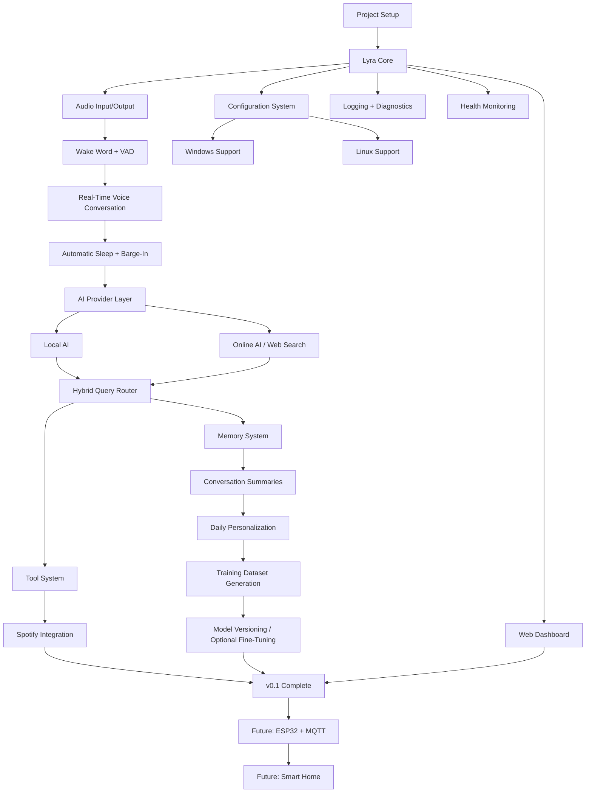
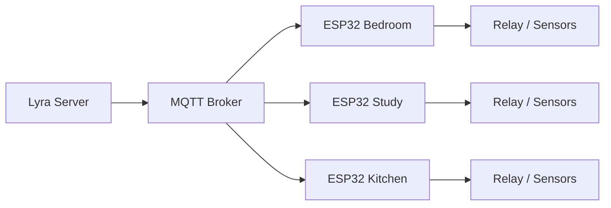

# Lyra — Initial Development Flowchart & Milestones

> **Project:** Lyra  
> **Goal:** Build a modular, cross-platform, voice-first personal AI assistant with real-time voice interaction, offline/online AI routing, personalization, Spotify integration, and an architecture ready for future ESP32 smart-home control.

---

# 1. Overall Development Flow



---

# 2. Target Initial Architecture

```text
                              ┌────────────────────┐
                              │       USER         │
                              │     🎤 Voice       │
                              └─────────┬──────────┘
                                        │
                                        ▼
                              ┌────────────────────┐
                              │    AUDIO LAYER     │
                              │ Wake Word / VAD    │
                              │ Mic / Speaker      │
                              └─────────┬──────────┘
                                        │
                                        ▼
                              ┌────────────────────┐
                              │     LYRA CORE      │
                              │ Session / State    │
                              │ Command Routing    │
                              └─────────┬──────────┘
                                        │
                         ┌──────────────┼──────────────┐
                         │              │              │
                         ▼              ▼              ▼
                  ┌────────────┐ ┌────────────┐ ┌────────────┐
                  │ Local AI   │ │ Online AI  │ │   Tools    │
                  │ Offline    │ │ Web/Search │ │ Spotify    │
                  └─────┬──────┘ └─────┬──────┘ └─────┬──────┘
                        │              │              │
                        └──────────────┼──────────────┘
                                       ▼
                              ┌────────────────────┐
                              │  MEMORY SYSTEM     │
                              │ Preferences / RAG  │
                              │ Conversations      │
                              └─────────┬──────────┘
                                        │
                                        ▼
                              ┌────────────────────┐
                              │ PERSONALIZATION    │
                              │ Hourly / Daily      │
                              │ Dataset Generation │
                              └─────────┬──────────┘
                                        │
                                        ▼
                              ┌────────────────────┐
                              │ DASHBOARD / ADMIN   │
                              │ Logs / Settings     │
                              │ Health / Versions   │
                              └────────────────────┘
```

---

# 3. Milestone Overview

| Milestone | Name | Main Result | Priority |
|---|---|---|---|
| M0 | Project Foundation | Reproducible development environment | Critical |
| M1 | Lyra Core | Basic assistant runtime | Critical |
| M2 | Audio System | Mic + speaker pipeline | Critical |
| M3 | Wake/Sleep | Hands-free activation | Critical |
| M4 | Real-Time Voice | Natural voice conversation | Critical |
| M5 | AI Provider Layer | Replaceable AI backends | Critical |
| M6 | Hybrid AI | Offline + online routing | High |
| M7 | Memory | Persistent personalization | High |
| M8 | Continuous Personalization | Hourly/daily learning pipeline | High |
| M9 | Spotify | Voice-controlled music | High |
| M10 | Cross-Platform | Windows + Linux support | Critical |
| M11 | Dashboard | Management and diagnostics UI | Medium |
| M12 | Release Hardening | Stable v0.1 release | Critical |
| F1 | ESP32/MQTT | Smart-home foundation | Future |
| F2 | Smart Home | Physical home control | Future |

---

# 4. M0 — Project Foundation

## Objective

Create a clean and reproducible project foundation before implementing AI functionality.

## Tasks

- [ ] Create GitHub repository
- [ ] Create README
- [ ] Create LICENSE
- [ ] Create `.gitignore`
- [ ] Define project coding conventions
- [ ] Create Python environment
- [ ] Define dependency management
- [ ] Add `.env.example`
- [ ] Create configuration module
- [ ] Create logging module
- [ ] Create test structure
- [ ] Create CI workflow
- [ ] Decide minimum supported Python version
- [ ] Define Windows and Linux support policy
- [ ] Create Docker/Docker Compose base configuration

## Deliverable

```text
Lyra repository starts and runs consistently on Windows and Linux.
```

## Exit Criteria

```text
git clone
    ↓
install dependencies
    ↓
configure .env
    ↓
run Lyra
    ↓
Lyra starts without manual source-code changes
```

---

# 5. M1 — Lyra Core

## Objective

Create the central runtime that coordinates all other modules.

## Components

```text
Lyra Core
├── Session Manager
├── State Manager
├── Event Bus
├── Command Router
├── Config Manager
└── Service Manager
```

## Tasks

- [ ] Create application entry point
- [ ] Create global configuration object
- [ ] Create assistant state machine
- [ ] Define states:
  - [ ] SLEEPING
  - [ ] WAKE
  - [ ] LISTENING
  - [ ] PROCESSING
  - [ ] SPEAKING
  - [ ] ERROR
- [ ] Create session manager
- [ ] Create event system
- [ ] Define module interfaces
- [ ] Implement graceful shutdown
- [ ] Add structured logging

## Deliverable

```text
A running Lyra process with a clear state machine.
```

---

# 6. M2 — Audio System

## Objective

Create reliable audio capture and playback.

## Audio Input

- [ ] Microphone selection
- [ ] PCM capture
- [ ] Sample-rate configuration
- [ ] Audio chunking
- [ ] Input buffering
- [ ] Noise handling
- [ ] Input device error recovery

## Audio Output

- [ ] Speaker selection
- [ ] PCM playback
- [ ] Output buffering
- [ ] Volume control
- [ ] Stop/cancel playback
- [ ] Output device error recovery

## Flow

```text
Microphone
   ↓
Audio Capture
   ↓
PCM Buffer
   ↓
Audio Processing
   ↓
AI/Voice Pipeline
```

```text
AI Audio
   ↓
Output Buffer
   ↓
Audio Player
   ↓
Speaker
```

## Deliverable

```text
Lyra can record from a microphone and play audio reliably.
```

---

# 7. M3 — Wake Word + VAD + Sleep

## Objective

Make Lyra hands-free.

## Wake Word

- [ ] Select wake-word engine
- [ ] Configure "Lyra" / "Hey Lyra"
- [ ] Local wake-word detection
- [ ] Test false activations
- [ ] Test noisy environments

## Voice Activity Detection

- [ ] Detect speech start
- [ ] Detect speech stop
- [ ] Configure silence timeout
- [ ] Handle background noise
- [ ] Handle long pauses

## Sleep System

- [ ] Enter sleep after conversation
- [ ] Sleep after configurable inactivity
- [ ] `"Lyra, go to sleep"`
- [ ] `"Stop listening"`
- [ ] Manual wake
- [ ] Ensure no unnecessary cloud audio while sleeping

## Deliverable

```text
Lyra stays idle, wakes on its name, listens, completes the interaction,
and automatically goes back to sleep.
```

---

# 8. M4 — Real-Time Voice Conversation

## Objective

Turn Lyra into a natural conversational voice assistant.

## Tasks

- [ ] Establish real-time AI connection
- [ ] Implement streaming audio input
- [ ] Implement streaming audio output
- [ ] Implement session management
- [ ] Implement conversational context
- [ ] Implement response cancellation
- [ ] Implement barge-in
- [ ] Implement turn detection
- [ ] Handle network interruption
- [ ] Handle API errors
- [ ] Measure end-to-end latency

## Conversation Flow

```text
"Hey Lyra"
    ↓
Wake Word
    ↓
Listening
    ↓
User Speech
    ↓
Streaming Audio
    ↓
AI
    ↓
Streaming Response
    ↓
Lyra Speaks
    ↓
Wait for Follow-Up
    ↓
Silence / Goodbye
    ↓
Sleep
```

## Barge-In Flow

```text
Lyra Speaking
      ↓
User Starts Speaking
      ↓
Stop Current Playback
      ↓
Cancel/Update AI Response
      ↓
Process New Request
```

## Deliverable

```text
A complete real-time voice conversation loop.
```

---

# 9. M5 — AI Provider Abstraction

## Objective

Prevent the project from becoming locked to a single AI provider.

## Interface

Create provider-independent interfaces such as:

```python
class AIProvider:
    async def chat(self, request):
        ...

    async def stream(self, request):
        ...

    async def close(self):
        ...
```

## Planned Providers

- [ ] Local provider
- [ ] Gemini provider
- [ ] OpenAI provider
- [ ] Future providers

## Tasks

- [ ] Define common provider interface
- [ ] Implement provider factory
- [ ] Implement provider configuration
- [ ] Implement provider health checks
- [ ] Implement fallback behavior
- [ ] Add provider-specific tests

## Deliverable

```text
The AI provider can be changed through configuration without
rewriting Lyra Core.
```

---

# 10. M6 — Hybrid AI: Offline + Online

## Objective

Use local AI whenever possible and online tools when required.

## Router

```text
                  User Request
                       ↓
                 Query Router
                       ↓
             ┌─────────┼─────────┐
             │         │         │
             ▼         ▼         ▼
          Local      Online     Hybrid
             │         │         │
             └─────────┼─────────┘
                       ▼
                 Final Response
```

## Local AI Use Cases

- [ ] Casual conversation
- [ ] Basic explanations
- [ ] Writing
- [ ] Brainstorming
- [ ] Simple coding assistance
- [ ] Personal memory operations
- [ ] Local commands

## Online Use Cases

- [ ] Latest news
- [ ] Current weather
- [ ] Current prices
- [ ] Current events
- [ ] Live information
- [ ] Current documentation
- [ ] Web research
- [ ] External APIs

## Router Heuristics

Trigger online mode for terms/concepts such as:

```text
latest
today
current
recent
live
this week
this month
```

Also trigger online search when:

- [ ] User explicitly asks to search
- [ ] Current information is necessary
- [ ] Local model knowledge is insufficient
- [ ] A relevant external API is required

## Deliverable

```text
Lyra works offline for normal tasks and automatically uses online
sources when fresh/external information is needed.
```

---

# 11. M7 — Memory System

## Objective

Allow Lyra to remember user-approved information across sessions.

## Memory Categories

```text
Memory
├── Facts
├── Preferences
├── Habits
├── Projects
├── Study Context
├── Important Events
└── Conversation Summaries
```

## Features

- [ ] Memory database
- [ ] Memory creation
- [ ] Memory retrieval
- [ ] Memory update
- [ ] Memory deletion
- [ ] Memory search
- [ ] Relevance scoring
- [ ] Memory timestamps
- [ ] Memory source/session tracking

## Voice Commands

- [ ] `"Remember that..."`
- [ ] `"Forget that..."`
- [ ] `"What do you remember about me?"`
- [ ] `"Delete this memory."`
- [ ] `"Don't remember this."`

## Retrieval Flow

```text
User Query
    ↓
Relevant Memory Search
    ↓
Top Relevant Memories
    ↓
Context Builder
    ↓
AI
```

## Important Rule

Persistent memory should not be created automatically from every sentence.

Use:

```text
Explicit memory
    OR
High-confidence stable preference
    ↓
Store
```

## Deliverable

```text
Lyra remembers useful information while the user retains control over it.
```

---

# 12. M8 — Continuous Personalization

## Objective

Implement the user's "real-time fine-tune" idea as a controlled personalization pipeline.

## 12.1 Hourly Processing

```text
Recent Conversations
        ↓
Hourly Summarizer
        ↓
Important Facts / Preferences / Topics
        ↓
Hourly Summary
        ↓
Memory Candidate Extraction
```

## Hourly Tasks

- [ ] Select recent conversations
- [ ] Generate summary
- [ ] Extract stable preferences
- [ ] Extract explicit memory requests
- [ ] Extract unresolved tasks
- [ ] Store summary
- [ ] Store high-confidence memories

---

## 12.2 End-of-Day Processing

```text
Hourly Summaries
        +
Selected Conversation Data
        ↓
Daily Personalization Job
        ↓
Preference Extraction
        ↓
Training Example Generation
        ↓
Quality Filter
        ↓
Dataset Version
```

## Training Dataset Generation

Candidate examples may represent:

- Preferred response length
- Preferred explanation style
- Preferred tone
- Repeated command patterns
- Stable workflows
- Stable preferences

## Quality Controls

- [ ] Remove duplicates
- [ ] Reject contradictory examples
- [ ] Reject temporary preferences
- [ ] Reject incorrect information
- [ ] Reject low-quality conversations
- [ ] Validate formatting
- [ ] Version every dataset

## Important

Do **not** automatically fine-tune the production model every hour.

Instead:

```text
Conversation
    ↓
Summary
    ↓
Memory
    ↓
Candidate Dataset
    ↓
Evaluation
    ↓
Optional Training
    ↓
New Model Version
```

## Model Versioning

```text
base
 └── personalized-v1
       └── personalized-v2
             └── personalized-v3
```

Store:

- [ ] Model version
- [ ] Dataset version
- [ ] Training configuration
- [ ] Evaluation score/results
- [ ] Creation timestamp
- [ ] Change summary
- [ ] Rollback capability

## Deliverable

```text
Lyra gradually adapts to the user without destabilizing the production model.
```

---

# 13. M9 — Spotify Integration

## Objective

Control Spotify through natural voice commands.

## Authentication

- [ ] OAuth integration
- [ ] Secure token storage
- [ ] Token refresh
- [ ] Disconnect/revoke support

## Core Commands

- [ ] Play song
- [ ] Play artist
- [ ] Play album
- [ ] Play playlist
- [ ] Search
- [ ] Pause
- [ ] Resume
- [ ] Next
- [ ] Previous
- [ ] Shuffle
- [ ] Repeat
- [ ] Current track
- [ ] Queue
- [ ] Volume

## Example

```text
User:
"Lyra, play my study playlist."

        ↓

Command Router

        ↓

Spotify Tool

        ↓

Spotify API

        ↓

Playback
```

## Tool Interface

```python
spotify.search(query)
spotify.play(item)
spotify.pause()
spotify.resume()
spotify.next()
spotify.previous()
spotify.current()
```

## Deliverable

```text
Lyra can control music naturally by voice.
```

---

# 14. M10 — Cross-Platform Windows + Linux

## Objective

Make the application portable between Windows and Linux.

## Core Rule

Keep OS-specific functionality outside Lyra Core.

```text
platform/
├── base.py
├── windows.py
└── linux.py
```

## Examples

```python
system.shutdown()
system.volume_up()
system.volume_down()
system.open_application()
system.lock()
```

## Windows Tasks

- [ ] Audio devices
- [ ] Application launching
- [ ] Volume handling
- [ ] Startup option
- [ ] Process handling
- [ ] Environment setup

## Linux Tasks

- [ ] Audio devices
- [ ] Application launching
- [ ] Volume handling
- [ ] Startup/service option
- [ ] Process handling
- [ ] Environment setup

## Packaging

- [ ] Windows development setup
- [ ] Linux development setup
- [ ] Docker support
- [ ] `.env` configuration
- [ ] Installation documentation
- [ ] Upgrade documentation

## Deliverable

```text
The same Lyra architecture runs on both Windows and Linux with
minimal platform-specific changes.
```

---

# 15. M11 — Dashboard

## Objective

Provide a simple web interface for monitoring and configuration.

## Dashboard Sections

### Overview

- [ ] Lyra status
- [ ] AI provider status
- [ ] Spotify status
- [ ] Memory status
- [ ] Voice status

### Conversations

- [ ] Conversation history
- [ ] Search
- [ ] View
- [ ] Export
- [ ] Delete

### Memory

- [ ] List memories
- [ ] Search memories
- [ ] Edit memories
- [ ] Delete memories
- [ ] Clear memory

### Personalization

- [ ] View dataset versions
- [ ] View model versions
- [ ] View personalization history
- [ ] View latest summaries
- [ ] Rollback controls where supported

### System

- [ ] CPU usage
- [ ] RAM usage
- [ ] API latency
- [ ] Errors
- [ ] Service status
- [ ] Logs

### Settings

- [ ] AI provider
- [ ] Wake word
- [ ] Voice
- [ ] Language
- [ ] Sleep timeout
- [ ] Response style
- [ ] Memory settings

## Deliverable

```text
Lyra can be managed without editing source code.
```

---

# 16. M12 — Logging, Health & Reliability

## Objective

Make the system easy to debug and operate.

## Logging

Track:

- [ ] Startup
- [ ] Shutdown
- [ ] Wake-word events
- [ ] Conversation sessions
- [ ] AI requests
- [ ] AI latency
- [ ] Tool calls
- [ ] Spotify events
- [ ] Memory changes
- [ ] Scheduler jobs
- [ ] Errors

Example:

```text
19:30:03  Wake word detected
19:30:04  Session started
19:30:05  AI request sent
19:30:07  AI response started
19:30:10  Response completed
19:30:20  Session timed out
19:30:20  Lyra sleeping
```

## Health Endpoint

```http
GET /health
```

Example:

```json
{
  "lyra": "online",
  "ai": "connected",
  "spotify": "connected",
  "memory": "healthy",
  "voice": "ready"
}
```

## Reliability

- [ ] API timeout
- [ ] Automatic reconnect
- [ ] Provider fallback
- [ ] Audio device recovery
- [ ] Graceful shutdown
- [ ] Crash logging
- [ ] Service restart strategy

---

# 17. Security Milestone

## Objective

Protect user data, API credentials, and future device-control capabilities.

## Tasks

- [ ] Never hard-code API keys
- [ ] Use `.env` / secure secret storage
- [ ] Encrypt network communication
- [ ] Authenticate dashboard access
- [ ] Protect stored tokens
- [ ] Control memory access
- [ ] Add data deletion controls
- [ ] Add conversation export/delete
- [ ] Add sensitive command authorization
- [ ] Prepare for device authentication

## Future Physical Security

For actions such as:

- Door unlock
- Security disarm
- Gate control

Require additional authorization:

```text
Voice Command
     ↓
Identity Check
     ↓
PIN / Device Confirmation / Biometric
     ↓
Action
```

---

# 18. M13 — Release Testing

## Objective

Verify the complete initial system before v0.1.

## Functional Testing

- [ ] Wake word works
- [ ] Voice recording works
- [ ] Voice playback works
- [ ] Real-time conversation works
- [ ] Follow-up questions work
- [ ] Barge-in works
- [ ] Sleep works
- [ ] Local AI works
- [ ] Online fallback works
- [ ] Memory works
- [ ] Forget/delete memory works
- [ ] Hourly summary works
- [ ] Daily personalization works
- [ ] Spotify works
- [ ] Dashboard works
- [ ] Logging works
- [ ] Health endpoint works

## Failure Testing

- [ ] Internet disconnected
- [ ] AI provider unavailable
- [ ] Spotify unavailable
- [ ] Microphone disconnected
- [ ] Speaker disconnected
- [ ] Database unavailable
- [ ] Invalid credentials
- [ ] Invalid tool request
- [ ] Model unavailable

## Performance Testing

Measure:

- [ ] Wake-word latency
- [ ] Speech detection latency
- [ ] AI first-response latency
- [ ] End-to-end response latency
- [ ] Memory retrieval latency
- [ ] Spotify command latency
- [ ] CPU usage
- [ ] RAM usage

---

# 19. v0.1 Release Gate

Lyra v0.1 is ready when all of the following work:

```text
                ┌────────────────────────┐
                │       LYRA v0.1        │
                └───────────┬────────────┘
                            │
       ┌────────────────────┼────────────────────┐
       ▼                    ▼                    ▼
     Voice               Intelligence          Tools
       │                    │                    │
   Wake Word            Local AI             Spotify
   VAD                   Online AI            Commands
   Barge-In              Router               ─────────
   Auto Sleep            Memory
   Streaming             Personalization
       │                    │
       └────────────────────┼────────────────────┘
                            ▼
                    Cross-Platform
                     Windows/Linux
                            │
                            ▼
                     Dashboard/Logs
```

---

# 20. Initial Release Scope

## Must Have

- [ ] Voice wake word
- [ ] Voice input/output
- [ ] Real-time conversation
- [ ] Multi-turn context
- [ ] Barge-in
- [ ] Automatic sleep
- [ ] Local AI
- [ ] Online fallback/search
- [ ] AI provider abstraction
- [ ] Persistent memory
- [ ] Explicit remember/forget
- [ ] Hourly summaries
- [ ] Daily personalization pipeline
- [ ] Spotify integration
- [ ] Windows support
- [ ] Linux support
- [ ] Logging
- [ ] Health endpoint

## Should Have

- [ ] Dashboard
- [ ] Model versioning
- [ ] Dataset versioning
- [ ] Rollback
- [ ] Conversation export
- [ ] Memory management UI
- [ ] API latency monitoring
- [ ] Docker deployment

## Future

- [ ] ESP32 voice terminals
- [ ] MQTT
- [ ] Smart lights
- [ ] Smart fans
- [ ] Sensors
- [ ] Relays
- [ ] Alarms
- [ ] Calendar
- [ ] Computer control
- [ ] Security/access control
- [ ] Vision
- [ ] Proactive assistant
- [ ] Multi-room audio

---

# 21. Future ESP32 / Smart-Home Milestone

After v0.1 is stable:



## ESP32 Tasks

- [ ] Device registration
- [ ] Device authentication
- [ ] MQTT connection
- [ ] Command subscription
- [ ] State publishing
- [ ] Relay control
- [ ] Sensor data
- [ ] Offline device state
- [ ] Reconnection
- [ ] OTA updates

Example topics:

```text
home/bedroom/light/set
home/bedroom/light/state

home/study/fan/set
home/study/fan/state

home/kitchen/light/set
home/kitchen/light/state
```

---

# 22. Recommended Final Milestone Sequence

```text
M0  Foundation
 │
 ▼
M1  Lyra Core
 │
 ▼
M2  Audio
 │
 ▼
M3  Wake Word + VAD + Sleep
 │
 ▼
M4  Real-Time Voice
 │
 ▼
M5  AI Provider Abstraction
 │
 ▼
M6  Local + Online AI Router
 │
 ▼
M7  Memory
 │
 ▼
M8  Continuous Personalization
 │
 ▼
M9  Spotify
 │
 ▼
M10 Windows + Linux
 │
 ▼
M11 Dashboard
 │
 ▼
M12 Reliability + Security
 │
 ▼
M13 Testing
 │
 ▼
┌───────────────────┐
│    LYRA v0.1      │
│ Initial Release   │
└─────────┬─────────┘
          │
          ▼
   Future Expansion
          │
   ┌──────┼─────────┐
   ▼      ▼         ▼
 ESP32   Home      More AI
 MQTT    Control   Capabilities
```

---

# 23. Initial Development Principle

Build Lyra in this order:

```text
FIRST:
Make it work.

SECOND:
Make it reliable.

THIRD:
Make it modular.

FOURTH:
Make it personalized.

FIFTH:
Add more devices/features.
```

Do not add smart-home hardware before the voice + AI core is stable.

Do not make model fine-tuning a dependency for basic personalization.

Do not tie Lyra Core to one AI provider.

Keep data, AI, tools, and platform-specific code separated.

---

# 24. Definition of Success for the Initial Version

A successful Lyra v0.1 session should look like:

```text
Lyra is sleeping
      ↓
"Hey Lyra"
      ↓
Lyra wakes
      ↓
"What's the latest weather?"
      ↓
Router detects current information
      ↓
Online search/API
      ↓
Lyra responds by voice
      ↓
"Now play my study playlist."
      ↓
Spotify tool
      ↓
Music starts
      ↓
"Also explain binary search."
      ↓
Local/online AI
      ↓
Lyra explains
      ↓
User stops talking
      ↓
Lyra becomes idle
      ↓
Timeout
      ↓
Lyra sleeps
      ↓
Hourly summary job
      ↓
Daily personalization
      ↓
Candidate dataset update
```

**Target:** a stable, portable, modular **Lyra v0.1** that feels like a personal voice assistant before expanding into the ESP32 smart-home ecosystem.
